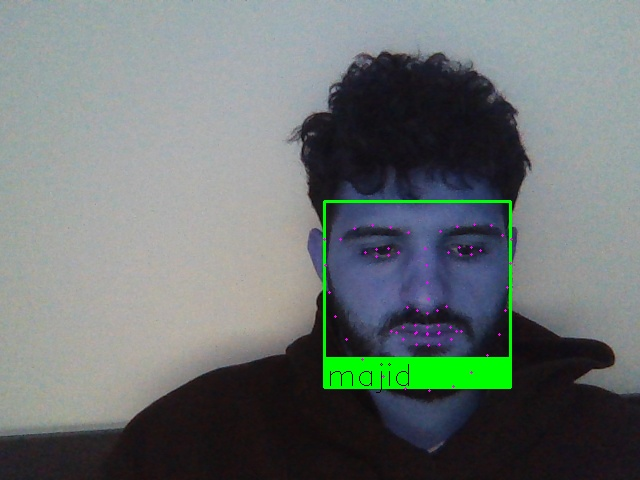

## Auteur

<p> Bignet Camille </p> 
<p> Akharaz Majid </p>

### Pre-requis

Assurez vous d'avoir installé les librairies suivantes :

- opencv
- dlib
- numpy
- imutils
- pillow


## Exemple



## Pour être reconnu pas l'algorithme.
Vous devez joindre une photo de vous format .png .jpg (tenter les deux formats) dans le dossier Knwon_faces


## Charger vos photos dans le dossier known_faces (n'oublier pas d'activer votre webcam).

## Pour lancer l'application (n'oublier pas d'activer votre webcam) :
```
python3 reconnaissance_facial.py --i known_faces
```

## Pour quitter la reconnaissance facial :
```
Cliquer sur q
```


## Pour toutes questions merci de contacter:

<p> majid.akharaz@gmail.com </p>
<p> camillebignet@live.fr </p>
